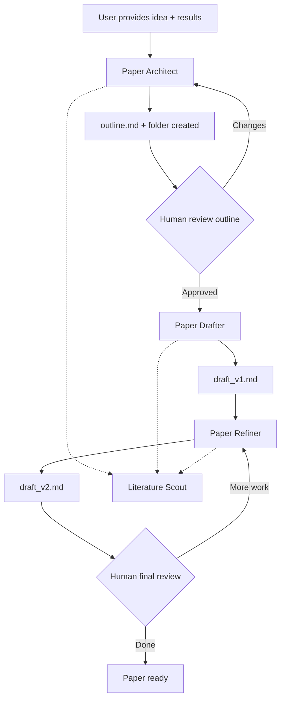

# Paper Pipeline Flow


```mermaid
flowchart TD
    A[User provides idea + results] --> B[Paper Architect]
    B --> C[outline.md + folder created]
    C --> D{Human review outline}
    D -->|Approved| E[Paper Drafter]
    D -->|Changes| B
    E --> F[draft_v1.md]
    F --> G[Paper Refiner]
    G --> H[draft_v2.md]
    H --> I{Human final review}
    I -->|Done| J[Paper ready]
    I -->|More work| G

    B -.-> K[Literature Scout]
    E -.-> K
    G -.-> K
```

**Shared folder structure:**
```
Draft/<PaperName>/
├── outline.md
├── draft_v1.md
├── draft_v2.md
├── references.bib
└── review_notes.md
```
