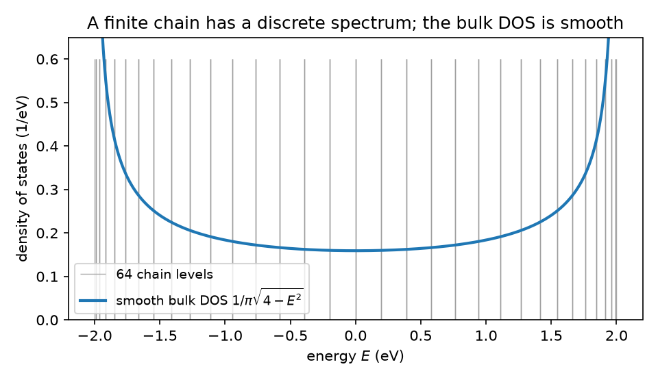
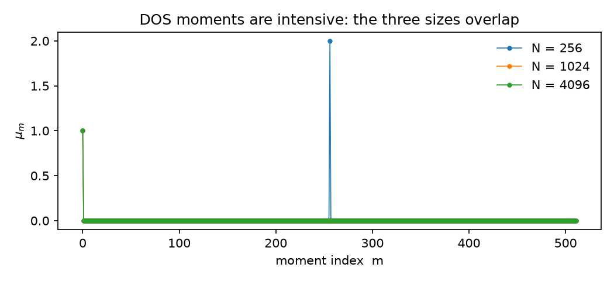
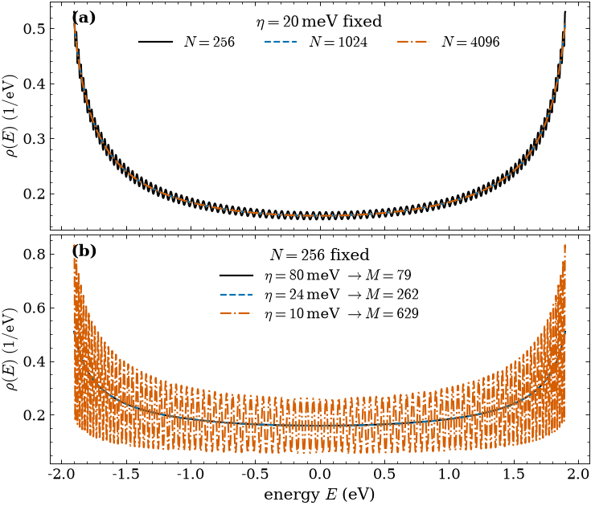

# Tutorial 1: The density of states of a 1D chain

A single quantum particle hopping along a chain of atoms is about the simplest
thing in solid-state physics, and it already hides a puzzle. A chain of $N$ atoms
has exactly $N$ energy levels, a finite list of sharp numbers. Yet we routinely
draw its density of states as a smooth curve, as if energy came in a continuum.
Where does the smooth curve come from, and what did we throw away to get it?

That gap between a finite spectrum and a smooth density is the finite-size
problem, and it sits underneath every large-scale calculation LinQT does. Here we
watch it appear on the 1D chain and watch the kernel polynomial method (KPM) tame
it with a single dial: the number of Chebyshev moments we keep. The lesson here is
the one that returns in every later tutorial, that the moment count is the
resolution dial and the finiteness of the sample hides in a single revival.

## The physics

The chain has $N$ sites, one orbital each, periodic boundaries, and a single
hopping amplitude $t = -1\ \mathrm{eV}$:

$$ H = t\sum_i \big( |i\rangle\langle i+1| + |i+1\rangle\langle i| \big), \qquad i+1 \ \mathrm{mod}\ N. $$

Its eigenvalues are known in closed form, $E_k = 2t\cos(2\pi k/N)$, so the
spectrum fills the band $[-2, 2]\ \mathrm{eV}$. In the infinite-chain limit those
$N$ points crowd into a smooth density of states,

$$ \rho(E) = \frac{1}{\pi\sqrt{4 - E^2}}, $$

with van Hove divergences at the band edges $E = \pm 2\ \mathrm{eV}$, where the
levels bunch most tightly.

KPM reaches that curve without diagonalizing $H$. It expands the density of states
in Chebyshev polynomials of the rescaled Hamiltonian $\tilde H = (H - b)/a$, where
$(a, b)$ map the band onto $[-1, 1]$, and the expansion coefficients are the
moments

$$ \mu_m = \frac{1}{N}\,\mathrm{Tr}\,T_m(\tilde H). $$

For this chain the trace can be done by hand, and the answer drives everything
that follows: using $T_m(\cos\theta) = \cos m\theta$ and the discrete
orthogonality of the $N$ levels,

$$ \mu_m = \frac{1}{N}\sum_{k=0}^{N-1}\cos\!\Big(\frac{2\pi m k}{N}\Big) = \delta_{m,0} + \delta_{m,N} + \delta_{m,2N} + \cdots $$

The bulk density of states is exactly the Chebyshev weight, so its expansion
terminates at the very first term: $\mu_0 = 1$ and nothing else, all the way up to
$m = N$. The finiteness of the chain changes no low-order moment. It hides in one
place only, a revival where $\mu_m$ spikes again at $m = N$ and every multiple
after, the spectrum reminding us it is discrete.

The whole problem sits in one frame below: a finite comb of sharp levels under the
smooth curve we wish we had.



## Step 1: build the chain

Build three sizes, chosen so the revival lands where we can see it.

```bash
python make_chain.py 256
python make_chain.py 1024
python make_chain.py 4096
```

Each call writes, for label `chain1d_N<N>`, the sparse Hamiltonian, its spectral
bounds, an exact-trace state set, and a small companion file recording what the
matrix physically is (a Hamiltonian, in eV, with its band edges), so a result
stays traceable to the operator that made it. The next steps read these.

## Step 2: compute the moments

The identity operator has label `1`, and the density of states is its spectral
function. We run the Chebyshev recursion on the smallest chain, asking for $512$
moments so the revival at $m = 256$ and its echoes are in range:

```bash
cat > run_dos.json <<'JSON'
{ "mode": "spectral", "label": "chain1d_N256", "operator": "1",
  "num_moments": 512, "state": "exact_chain1d_N256" }
JSON
lsquant compute --config run_dos.json
```

This evaluates $\mu_m = \mathrm{Tr}\,T_m(\tilde H)/N$ over the full basis, with no
random vectors, so the moments are deterministic and equal the analytic trace. It
writes one moment file:

```
SpectralOp1chain1d_N256KPM_M512_stateexact_chain1d_N256.chebmom1D
```

Repeat for `chain1d_N1024` and `chain1d_N4096`.

## Step 3: the moments are intensive

Read the moments back and overlay the three sizes:

```bash
python -c "import lsqplot; lsqplot.figure_moments([256, 1024, 4096], M=512)"
```



The three curves are indistinguishable below their revivals: every one sits at
$\mu_m = \delta_{m,0}$. The density of states is a per-site property, so its
moments do not care how long the chain is. That is what intensive means here, and
it is why one expansion can describe a chain of 256 atoms or 256 million. The
curves part company only at the revival: the $N = 256$ moments spike back up at
$m = 256$ (to $2$, since the plotted Chebyshev moments carry the conventional
factor of $2$ for $m>0$), while the $N = 1024$ and $N = 4096$ chains revive only
at $m = 1024$ and $m = 4096$, beyond this window. A chain announces its finite
size at exactly $m = N$, and never before.

## Step 4: reconstruct the DOS

To turn moments back into a curve we sum

$$ \rho(E) = \sum_m g_m\,\mu_m\,T_m(E), $$

over a fine energy grid, where $g_m$ are the Jackson kernel coefficients that
suppress the ringing of a truncated series. Run it once at a $120\ \mathrm{meV}$
broadening:

```bash
lsquant reconstruct SpectralOp1chain1d_N256KPM_M512_state*.chebmom1D dos 120
```

This writes a two-column file of energy against the extensive DOS $N\rho(E)$;
dividing by $N$ from the moment-file header gives the per-site density that matches
$\rho(E) = 1/(\pi\sqrt{4 - E^2})$. The kernel keeps

$$ M_{\mathrm{eff}} = \Big\lceil \frac{\pi\,W_{1/2}}{\eta} \Big\rceil \quad\Longleftrightarrow\quad \eta = \frac{\pi\,W_{1/2}}{M_{\mathrm{eff}}}, $$

so the broadening $\eta$ and the moment count are two names for one quantity. With
$W_{1/2} = 2\ \mathrm{eV}$ this is $\eta = 2\pi / M_{\mathrm{eff}}\ \mathrm{eV}$.

Here is the subtlety worth pausing on. While $\mu_m = \delta_{m,0}$, the broadening
does nothing: with only the $m = 0$ moment nonzero the sum collapses to
$g_0\,\mu_0$ times the Chebyshev weight, and $g_0 = 1$ for any Jackson kernel, so
the reconstruction returns the exact bulk $\rho(E)$ whatever broadening you choose.
The dial starts to turn something only once $M_{\mathrm{eff}}$ reaches $m = N$,
where the revival feeds real structure into the sum.

## Step 5: resolution follows the moment count

Regenerate the two-panel figure, then read it:

```bash
python lsqplot.py
```



The top panel fixes the broadening at $20\ \mathrm{meV}$ ($M_{\mathrm{eff}}\approx 315$)
and varies the size. The $N = 256$ chain has $M_{\mathrm{eff}} > N$, so its curve
already resolves its 256 discrete levels; the $N = 1024$ and $N = 4096$ chains keep
$M_{\mathrm{eff}} < N$, so they follow the smooth bulk form with its van Hove peaks
at $\pm 2\ \mathrm{eV}$. The bottom panel fixes $N = 256$ and sweeps the broadening
across the threshold: at $80\ \mathrm{meV}$ ($M_{\mathrm{eff}}\approx 79$) the curve
is the smooth bulk band; at $24\ \mathrm{meV}$ ($M_{\mathrm{eff}}\approx 262$) the
discrete levels begin to emerge; at $10\ \mathrm{meV}$ ($M_{\mathrm{eff}}\approx 512$)
they stand out one by one. The transition is not gradual: it switches on at
$m = N$, because that is where the moments first carry the finite spectrum.

## What to take away

- The bulk density of states of this chain is the Chebyshev weight itself, so its
  moments are $\mu_m = \delta_{m,0}$ and a single moment reconstructs it exactly.
- The moments are intensive: every chain length gives the same low-order moments,
  which is what lets one expansion scale to enormous systems.
- A finite chain enters only through the aliasing revival at $m = N$. Below it you
  see the smooth bulk; above it you resolve the discrete levels.
- The KPM broadening is $\eta = \pi W_{1/2} / M$, so the moment count is the
  resolution knob, no more and no less.

The next tutorial reuses this chain and a velocity operator to measure how
disorder localizes it, where the same time-dependent moments give a localization
length.

## References and links

- LinQT source and documentation: https://github.com/adamecius/lsquant
- Methodology: Z. Fan, J. H. García, A. W. Cummings et al., *Linear Scaling
  Quantum Transport Methodologies*, arXiv:1811.07387.
- Installation: see the main README of the repository.

## Further reading

- A. Weisse, G. Wellein, A. Alvermann, H. Fehske, *The kernel polynomial method*,
  Rev. Mod. Phys. **78**, 275 (2006).
