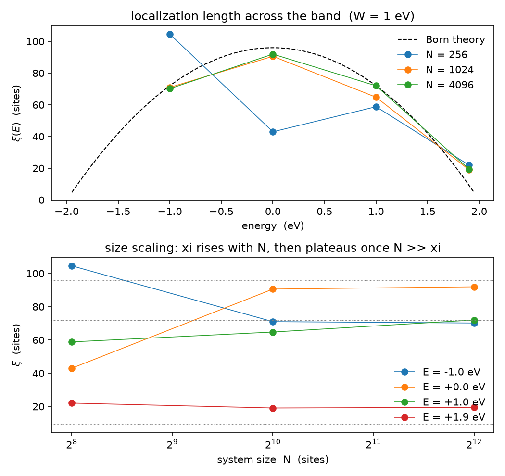

# Tutorial 2: How a 1D wire localizes under disorder

Take the clean chain of Tutorial 1, where a wavepacket spreads forever, and
sprinkle a little randomness on the site energies. Something drastic happens that
has no analogue in three dimensions: the wavepacket stops. Every eigenstate, at
every energy, however weak the disorder, becomes exponentially trapped over some
length $\xi$, and the wire turns into an insulator. The puzzle is not whether
this happens but how far the particle gets first, and how that distance changes
as we move across the band.

We measure that distance without diagonalizing anything, by watching how far a
wavepacket spreads before disorder pins it. The lesson here is that the
localization length is a property we can read straight off the spreading, that it
follows the band the way weak-disorder theory predicts, and that a finite sample
only reveals it once the sample itself is a few $\xi$ long.

## The physics

The Anderson chain keeps the nearest-neighbour hopping of Tutorial 1 and adds an
independent random energy on each site,

$$ H = t\sum_i \big( |i\rangle\langle i+1| + |i+1\rangle\langle i| \big) + \sum_i \epsilon_i\,|i\rangle\langle i|, \qquad \epsilon_i \ \text{uniform in}\ [-W/2,\,W/2], \quad t = -1\ \mathrm{eV}. $$

For any nonzero $W$ every eigenstate is exponentially localized, so the chain is
an insulator at all energies: the one-parameter scaling flow of localization runs
to the localized fixed point for all conductances in one dimension. The
localization length is the inverse Lyapunov exponent, $\xi(E) = 1/\gamma(E)$, and
in the weak-disorder (Born) regime, away from the centre and the edges, box
disorder gives

$$ \xi(E) \approx \frac{24\,(4 - E^2)}{W^2}. $$

Two places in the band break this form. At the centre the Kappus-Wegner anomaly
lifts the value to $\xi(0) \approx 105/W^2$, above the Born estimate $96/W^2$.
Near the edges $E \to \pm 2$ the Lyapunov exponent follows a separate
$\gamma \sim W^{2/3}$ law, so the Born curve gives way there.

The single idea that makes this measurable: a localized state cannot let a
wavepacket spread past its own size. The clean chain spreads ballistically,
$\mathrm{MSD}(E,t)\sim t^2$; disorder bends that growth over and parks it on a
plateau whose height is set by $\xi(E)$, so $\sqrt{\mathrm{MSD}_{\mathrm{plateau}}}$
tracks the localization length. The moments of that spreading come from the same
Chebyshev recursion that gave the density of states.

## Step 1: build a disordered chain

Onsite disorder sits on the diagonal, so the velocity operator stays the clean
one and the band edges widen to $\pm(2 + W/2)$:

```bash
python make_disordered_chain.py 512 1.0 1
```

This writes, for label `chain1d_dis_N512_W1`, the disordered Hamiltonian and its
velocity operator, the widened spectral bounds, and a sidecar that records the
disorder strength $W$ and the seed, so a result stays traceable to the exact
sample that produced it. The next step reads them.

## Step 2: the spreading carries the localization length

Run the time-dependent recursion to get the spreading moments, then reconstruct
$\mathrm{MSD}(E,t)$ at a Fermi energy:

```bash
inline_compute-kpm-MeanSquareDisplacement chain1d_dis_N512_W1 VX 256 128 600
inline_timeCorrelationsFromChebmom Correlation*chain1d_dis_N512_W1*chebmomTD 10 0.0
```

This evaluates the velocity-velocity correlation over $128$ time steps out to
$t = 600$ and writes a time-dependent moment file, then a two-column curve of
time against $\mathrm{MSD}(E,t)$:

```
mean...EF0.000000...JACKSON.dat
```

The window has to reach $t = 600$ for a physical reason. At $W = 1$ the interior
localization length is $\xi \approx 70$ to $100$ sites, so the wavepacket spreads
ballistically up to $\xi$ and only then settles; a short window stops while the
$\mathrm{MSD}$ is still climbing, far below its plateau, and reports a localization
length that is too small. A random vector seeds the trace, so $\mathtt{KPM\_SEED}$
makes each run reproducible, and one realisation per sample keeps the disorder
average honest.

## Step 3: the localization length follows the band

A single realisation is noisy, so the study averages $\mathrm{MSD}(E,t)$ over
disorder samples, reads $\sqrt{\mathrm{MSD}_{\mathrm{plateau}}}$ at each energy,
and fixes one overall constant against the clean ballistic reference:

```bash
python lsqloc.py
```



The top panel reads the localization length across the band against the Born
curve. Through the interior the largest sample follows $\xi(E)\approx 24(4-E^2)/W^2$:
the $E=\pm1$ points land on the curve and agree with each other, confirming the
symmetry of the clean dispersion, while the centre approaches the Born value as
the size and the averaging grow. The near-edge point $E = 1.9$ leaves the curve,
where the $W^{2/3}$ edge law takes over. The centre carries the longest $\xi$, so
a small sample falls below the curve there first. The Kappus-Wegner enhancement
at the very centre, a few percent above Born, sits inside the disorder noise of
this study, so the centre point lands on the Born curve rather than visibly above
it.

The bottom panel is the trap named plainly. Each curve rises with the chain
length $N$ while the sample is shorter than $\xi$, then settles on the
disorder-limited value once $N$ passes a few $\xi$. The near-edge energy, with the
shortest $\xi$, plateaus first; the centre, with the longest $\xi$, needs the
largest $N$. Reaching the theory therefore asks for two things at once: a sample
longer than the state it must hold, and a disorder strong enough to keep $\xi$
inside reachable $N$ while staying weak enough for the Born formula to apply.

## What to take away

- Disorder localizes every state in one dimension, so the chain is an insulator
  across the whole band, no matter how weak the disorder.
- The localization length follows $\xi(E)\approx 24(4-E^2)/W^2$ in the band
  interior and changes law near the edges, with a small Kappus-Wegner
  enhancement at the centre that only heavy averaging resolves.
- The mean-square-displacement plateau is a direct localization-length proxy: its
  $1/W^2$ and $(4-E^2)$ trends read straight off the spreading, so halving $W$
  roughly quadruples $\xi$.
- A finite sample recovers the theory only once its length passes a few $\xi$,
  which sets how large $N$ and how strong $W$ the study needs.

The next tutorial keeps the velocity operator but moves to two dimensions and a
topological band, where the same Chebyshev moments give a quantized Hall plateau.

## References and links

- LinQT source and documentation: https://github.com/adamecius/lsquant
- Methodology: Z. Fan, J. H. García, A. W. Cummings et al., *Linear Scaling
  Quantum Transport Methodologies*, arXiv:1811.07387.
- Installation: see the main README of the repository.

## Further reading

- Localization-length anomalies of the 1D Anderson model (weak-disorder Born
  result and the band-centre and band-edge anomalies), arXiv:cond-mat/9801226.
