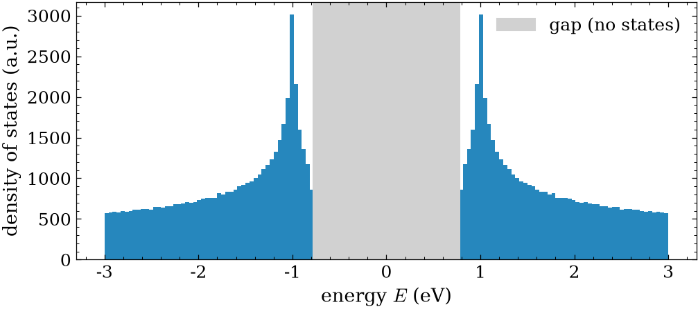
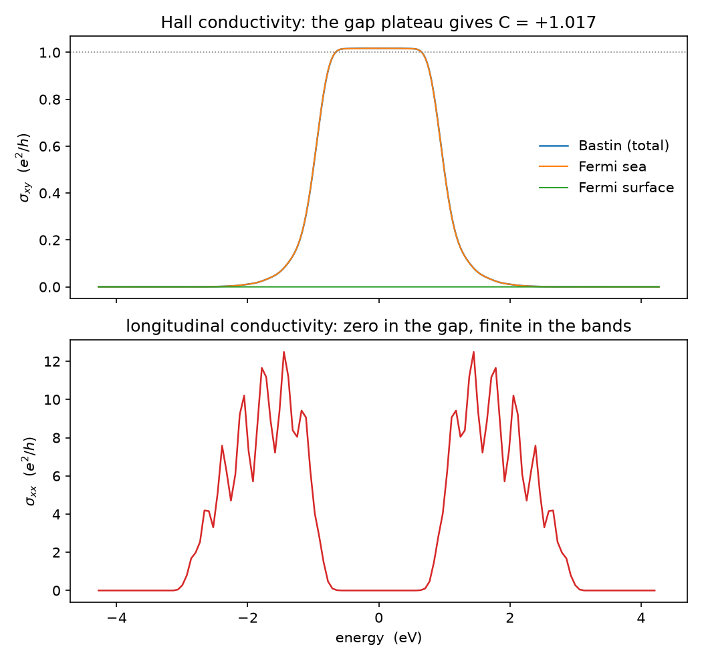
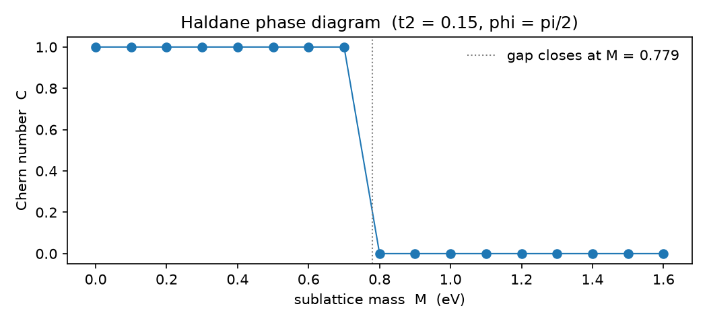

# Tutorial 3: A quantized Hall current without a magnetic field

Hall conductance was supposed to need a magnetic field: ramp the field, and the
transverse conductivity climbs a staircase of plateaus quantized in units of
$e^2/h$. Haldane's surprise was that the field is optional. Put complex
next-nearest-neighbour hoppings on a honeycomb lattice, arrange them so the net
flux through each cell is zero, and the system still carries a Hall current locked
to an integer times $e^2/h$, with no Landau levels anywhere in sight.

If the quantization does not come from a field, where does it come from, and why
does it survive in a gap where there are no states at the Fermi level to carry
current? We compute the Hall and longitudinal conductivities and split the Hall
response into its pieces to answer both. The lesson here is that the plateau is a
property of the entire filled Fermi sea, fixed by a topological integer of the
bands, while the longitudinal conductivity, which needs a Fermi surface, vanishes
in the same gap.

## The physics

The Haldane model lives on a honeycomb lattice with a real nearest-neighbour
hopping $t_1$, a complex next-nearest-neighbour hopping $t_2 e^{i\phi}$ that
carries a staggered flux, and an optional sublattice mass $M$:

$$ H = t_1\!\sum_{\langle ij\rangle} c_i^\dagger c_j \;+\; t_2\!\sum_{\langle\langle ij\rangle\rangle} e^{i\nu_{ij}\phi}\,c_i^\dagger c_j \;+\; M\sum_i \xi_i\,c_i^\dagger c_i, \qquad \nu_{ij},\,\xi_i = \pm 1. $$

At $t_1 = -1$, $t_2 = 0.15$, $\phi = \pi/2$, $M = 0$ the lower band carries Chern
number $C = +1$, so the model is a Chern insulator. With the Fermi level in the
gap the Hall conductivity is quantized,

$$ \sigma_{xy} = C\,\frac{e^2}{h}, $$

a bulk topological response that LSQUANT reads from the velocity-velocity Chebyshev
moments through the Kubo-Bastin route.

The Kubo-Bastin conductivity splits into a Fermi-surface part, built from states
at the Fermi level, and a Fermi-sea part, built from every filled state below it:

$$ \sigma_{xy} = \sigma^{\mathrm{surface}} + \sigma^{\mathrm{sea}}. $$

The Kubo-Greenwood conductivity is a pure Fermi-surface quantity, so it gives the
longitudinal $\sigma_{xx}$ and stays zero wherever the Fermi level sits in a gap.
Here is the result the tutorial turns on: inside the gap the Fermi surface is
empty, so $\sigma^{\mathrm{surface}}$ vanishes and the entire quantized plateau is
carried by the Fermi sea. That is why a topological insulator can pass a Hall
current while passing no longitudinal current at all.

The starting point is the spectrum itself: the Haldane model is an insulator with a
clean gap at the neutrality point, and that gap is what carries the quantized Hall
current.



## Step 1: stage the operators

The committed Haldane operators are the verified $C = +1$ model. Stage them into
this folder with the descriptor and an exact-trace state set:

```bash
python make_haldane.py
```

This writes the Hamiltonian and its two velocity operators, the sidecar carrying
the spectral bounds $[-4.5, 4.5]$ that enclose the spectrum $(|E|_{\max}\approx 3)$,
and a state set that evaluates $\mathrm{Tr}[\cdots]/\dim$ over the full basis, so
the moments are deterministic. Confirm the run before computing:

```bash
lsquant inspect operators/haldane.HAM.desc
```

This prints the observable, the units, the provenance, and the bounds that
`lsquant compute` reads straight from the descriptor, so the run needs no separate
bounds file.

## Step 2: the velocity-velocity moments

The Hall response is the off-diagonal correlation $V_X$-$V_Y$; the longitudinal
response is the diagonal $V_X$-$V_X$. Each is a small `run.json` fed to the one
`lsquant` binary:

```bash
cat > run_hall.json <<'JSON'
{ "label": "haldane", "operator_right": "VX", "operator_left": "VY",
  "num_moments": 128, "kernel": "jackson", "state": "exact" }
JSON
cat > run_long.json <<'JSON'
{ "label": "haldane", "operator_right": "VX", "operator_left": "VX",
  "num_moments": 128, "kernel": "jackson", "state": "exact" }
JSON
lsquant compute --config run_hall.json
lsquant compute --config run_long.json
```

Each call runs the two-operator Chebyshev recursion with $128$ moments per
direction and writes a `NonEqOp...chebmom2D` moment file.

> **Unified alternative.** Because both responses live on the *same system*, one
> `lsquant run` config computes them together and writes a single
> `haldane.results.json` (thin-grid $\sigma_{xy}$ and $\sigma_{xx}$ plus timing,
> peak memory, and the system fingerprint):
>
> ```json
> { "system":   { "label": "haldane", "operators_dir": "operators" },
>   "numerics": { "num_moments": 128, "broadening_meV": 10, "state": "exact" },
>   "observables": [ { "kind": "conductivity", "component": "xy" },
>                    { "kind": "conductivity", "component": "xx" } ] }
> ```
> ```bash
> lsquant run --config run.json
> python ../../utilities/python/lsquant_report.py haldane.results.json   # table + HTML
> ```
>
> The step-by-step `compute`/`reconstruct` path below is kept because it also
> splits the Fermi-sea and Fermi-surface parts, which is the point of this tutorial.

## Step 3: the plateau belongs to the Fermi sea

Reconstruct the total Hall conductivity, then the same response split into its
Fermi-sea and Fermi-surface parts, and the longitudinal conductivity:

```bash
lsquant reconstruct NonEqOpVX-VYhaldane*.chebmom2D bastin 10        # sigma_xy total
inline_kuboBastinSeaFromChebmom  NonEqOpVX-VYhaldane*.chebmom2D 10  # Fermi sea   (soon: reconstruct … bastin-sea)
inline_kuboBastinSurfFromChebmom NonEqOpVX-VYhaldane*.chebmom2D 10  # Fermi surface (soon: reconstruct … bastin-surf)
lsquant reconstruct NonEqOpVX-VXhaldane*.chebmom2D greenwood 10     # sigma_xx
python lsqhall.py
```

> **Entry points.** The total $\sigma_{xy}$ and $\sigma_{xx}$ use the modern
> `lsquant reconstruct … bastin|greenwood`. The Fermi-sea/Fermi-surface *split*
> still uses the `inline_kuboBastinSea/SurfFromChebmom` drivers; a unified
> `lsquant reconstruct` sea/surface option is planned.



The top panel reads the Hall conductivity in units of $e^2/h$. The total
Kubo-Bastin curve sits on a flat plateau at $1$ through the gap, so the Chern
number reads $C = (\text{plateau}/A)\,2\pi = +1$ with cell area
$A_{\mathrm{cell}} = 3\sqrt{3}/2$. The Fermi-sea curve carries the whole plateau;
the Fermi-surface curve stays pinned at zero in the gap and only turns on once the
Fermi level enters the bands. The quantized plateau is a Fermi-sea property, not a
Fermi-surface one.

The bottom panel reads the longitudinal $\sigma_{xx}$ from Kubo-Greenwood. It sits
at zero through the gap and rises inside the bands where states are available at
the Fermi level. So the same gap carries a quantized Hall current and a vanishing
longitudinal current at once: the defining signature of a topological insulator.

## Step 4: the plateau value is a k-space invariant

The plateau is not a transport accident; it equals the Chern number of the filled
band, a bulk invariant of the Bloch Hamiltonian. The companion script builds the
two-band $k$-space model, reads the Chern number off a $k$-grid, and sweeps the
sublattice mass:

```bash
python haldane_kspace.py
```



It reports $C = +1$ at the model parameters and $C = 0$ once the flux is removed.
Raising $M$ closes the gap at $M = 3\sqrt{3}\,t_2\sin\phi \approx 0.78\ \mathrm{eV}$,
where the Chern number drops from $+1$ to $0$. Past that point the real-space
$\sigma_{xy}$ plateau disappears too: the bulk invariant and the transport plateau
move together, because they are the same integer.

## What to take away

- The Haldane model carries a Hall current quantized to $C\,e^2/h$ in its gap with
  no magnetic field and no Landau levels.
- The plateau comes entirely from the Fermi sea; the Fermi-surface part of
  $\sigma_{xy}$ stays at zero through the gap.
- The longitudinal $\sigma_{xx}$ from Kubo-Greenwood vanishes in the gap and turns
  on in the bands, the insulator-then-metal crossover.
- The transport plateau equals the $k$-space Chern number, and both follow the
  same topological transition as the gap closes.

These same velocity-velocity moments, split by the Fermi-sea and Fermi-surface
routes, carry over directly to disordered and large-scale Chern systems, where the
$k$-space invariant of Step 4 is no longer available and the real-space response
is the only handle left.

## References and links

- LSQUANT source and documentation: https://github.com/adamecius/lsquant
- Methodology: Z. Fan, J. H. García, A. W. Cummings et al., *Linear Scaling
  Quantum Transport Methodologies*, arXiv:1811.07387.
- Installation: see the main README of the repository.

## Further reading

- F. D. M. Haldane, *Model for a quantum Hall effect without Landau levels*,
  Phys. Rev. Lett. **61**, 2015 (1988).
