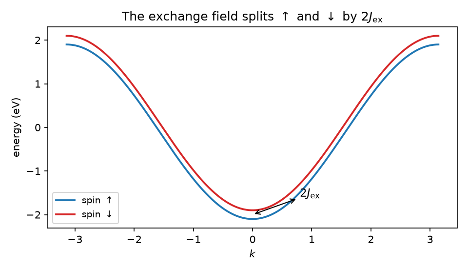
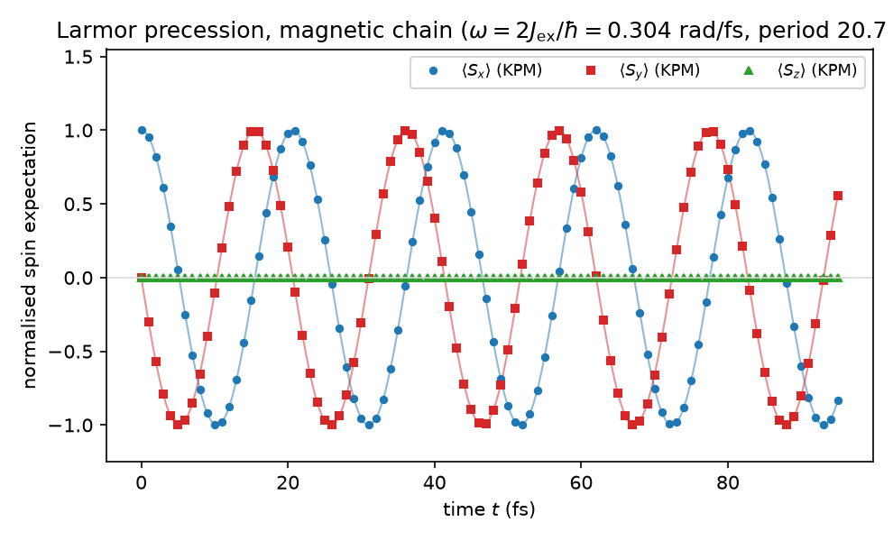

# Tutorial 4: How a spin keeps time in a magnetic chain

A compass needle in a magnetic field does not snap into alignment. It swings
around the field, precessing at a steady rate fixed by the field strength alone.
An electron spin does exactly the same, and that steady swing is a clock: as long
as the motion stays coherent, the spin keeps perfect time. The question this
tutorial answers is whether we can watch that clock run inside a tight-binding
solid, and whether its rate really depends on nothing but the field, not on which
electron happens to carry the spin.

We prepare a spin pointing along $x$, let it evolve under a chain with a Zeeman
field along $z$, and read back the three spin components in time. The lesson here
is that a clean magnetic field makes every spin precess at one Larmor frequency,
$\omega = 2J_{\rm ex}/\hbar$, the same at every energy, coherent and reversible.
The next tutorial breaks that coherence with disorder.

## The physics

The magnetic chain is the 1D hopping chain with a constant exchange (Zeeman)
field along $z$, acting on a two-component (spin) orbital per site:

$$ H = -2\gamma\cos(ka)\,\otimes\,\mathbb{1}_{\rm spin} \;-\; J_{\rm ex}\,\sigma_z, \qquad \gamma = 1\ \mathrm{eV},\quad J_{\rm ex} = 0.1\ \mathrm{eV}. $$

The field splits spin-up from spin-down by $2J_{\rm ex}$, so the spectrum is the
chain band shifted into two exchange-split copies filling $[-2.1, 2.1]\ \mathrm{eV}$.

A spin prepared along $+x$ is an equal superposition of the two $\sigma_z$
eigenstates, which acquire a relative phase $2J_{\rm ex}\,t/\hbar$ as they evolve.
That phase rotates the spin in the $x$-$y$ plane: it precesses. The single result
the tutorial turns on is that the precession frequency is the level splitting over
$\hbar$ and nothing else,

$$ \langle S_x(t)\rangle = \cos\omega t, \quad \langle S_y(t)\rangle = -\sin\omega t, \quad \langle S_z(t)\rangle = 0, \qquad \omega = \frac{2J_{\rm ex}}{\hbar}, $$

independent of the Fermi energy. In LinQT's physical units, $\hbar = 0.658\ \mathrm{eV\,fs}$
and time is in fs, so $\omega = 0.304\ \mathrm{rad/fs}$ and the period is
$2\pi/\omega = 20.7\ \mathrm{fs}$. LinQT obtains this by evolving the spin operator
in time with a Chebyshev expansion of $U(t) = e^{-iHt/\hbar}$, never diagonalizing
$H$.

The whole effect starts from the band structure: the exchange field splits the two
spin channels, and a spin built from both of them precesses at the splitting
frequency.



## Step 1: stage the operators

The operators are produced by [wannier2sparse](https://github.com/adamecius/wannier2sparse)
from the magnetic-chain model and shipped here, staged under `operators/`:

```bash
ls operators
```

Five operators carry the run: `chain1d_mag.HAM.CSR` is the chain with its Zeeman
field; `SX`, `SY`, `SZ` are the spin components we measure; and `PX` is the
projector $P_x = \tfrac12(\mathbb{1} + S_x)$ that prepares the initial $+x$-polarised
spin. Each carries a `.desc` sidecar recording what it physically is. See the
wannier2sparse site for the file format; here we only read them.

## Step 2: evolve the spin

For the spin started along $+x$ (the `PX` projector), evolve the state and record
each spin component over a 95 fs window, about four and a half precession periods:

```bash
for OP in SX SY SZ; do
  inline_compute-kpm-TimeEvProjetedOp chain1d_mag $OP PX 32 96 95 exact
done
```

This realises $|\phi(t)\rangle = U(t)\,P_x|\phi_r\rangle$ and records
$\langle\phi(t)|S_\alpha|\phi(t)\rangle$ over 96 time steps with 32 Chebyshev
moments, by exact trace over the full basis (deterministic, no random vectors). It
writes one time-dependent moment file per component:

```
TimeProjSX-PXchain1d_magKPM_M32_stateexact.chebmomTD
```

Because the precession is energy-independent, the energy-integrated spin is just
the $m=0$ Chebyshev moment, so no energy reconstruction is needed: the $m=0$ row
of each file is the spin component in time.

## Step 3: the spin keeps Larmor time

Read the three components back, normalise by $\langle S_x(0)\rangle$, and compare
to the analytic precession:

```bash
python lsqspin.py
```



The $\langle S_x\rangle$ points follow $\cos\omega t$ and $\langle S_y\rangle$
follow $-\sin\omega t$: the spin sweeps a full circle in the $x$-$y$ plane every
20.7 fs, while $\langle S_z\rangle$ stays pinned at zero, because the field is
along $z$ and cannot torque the $z$-component. The KPM points sit on the analytic
curves to machine precision, since the exact trace evaluates the time evolution
without statistical noise. Nothing damps: the amplitude stays at one for every
period. This is a clean clock, and its rate is set entirely by $2J_{\rm ex}$, the
same whatever the electron's energy.

## What to take away

- A Zeeman field makes a transverse spin precess at the Larmor frequency
  $\omega = 2J_{\rm ex}/\hbar$, fixed by the field alone.
- In a clean system the precession is coherent and reversible: the amplitude never
  decays, so the spin keeps perfect time.
- The frequency is energy-independent, so the energy-integrated spin (the $m=0$
  moment) already carries the full precession, with no reconstruction step.
- LinQT evolves the spin operator through a Chebyshev expansion of $e^{-iHt/\hbar}$,
  so the clock runs without ever diagonalizing $H$.

The next tutorial keeps this magnetic chain but adds disorder, which dephases the
two spin channels and turns this coherent precession into irreversible spin
relaxation over a time $\tau_s$.

## References and links

- LinQT source and documentation: https://github.com/adamecius/lsquant
- Methodology: Z. Fan, J. H. García, A. W. Cummings et al., *Linear Scaling
  Quantum Transport Methodologies*, arXiv:1811.07387.
- Installation: see the main README of the repository.

## Further reading

- A. W. Cummings, J. H. García, J. Fabian, S. Roche, *Giant Spin Lifetime
  Anisotropy in Graphene*, Phys. Rev. Lett. **119**, 206601 (2017).
