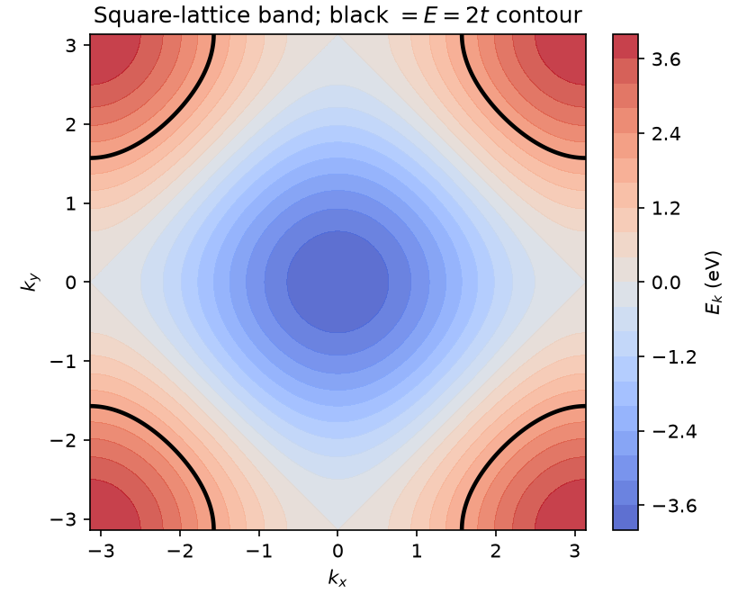
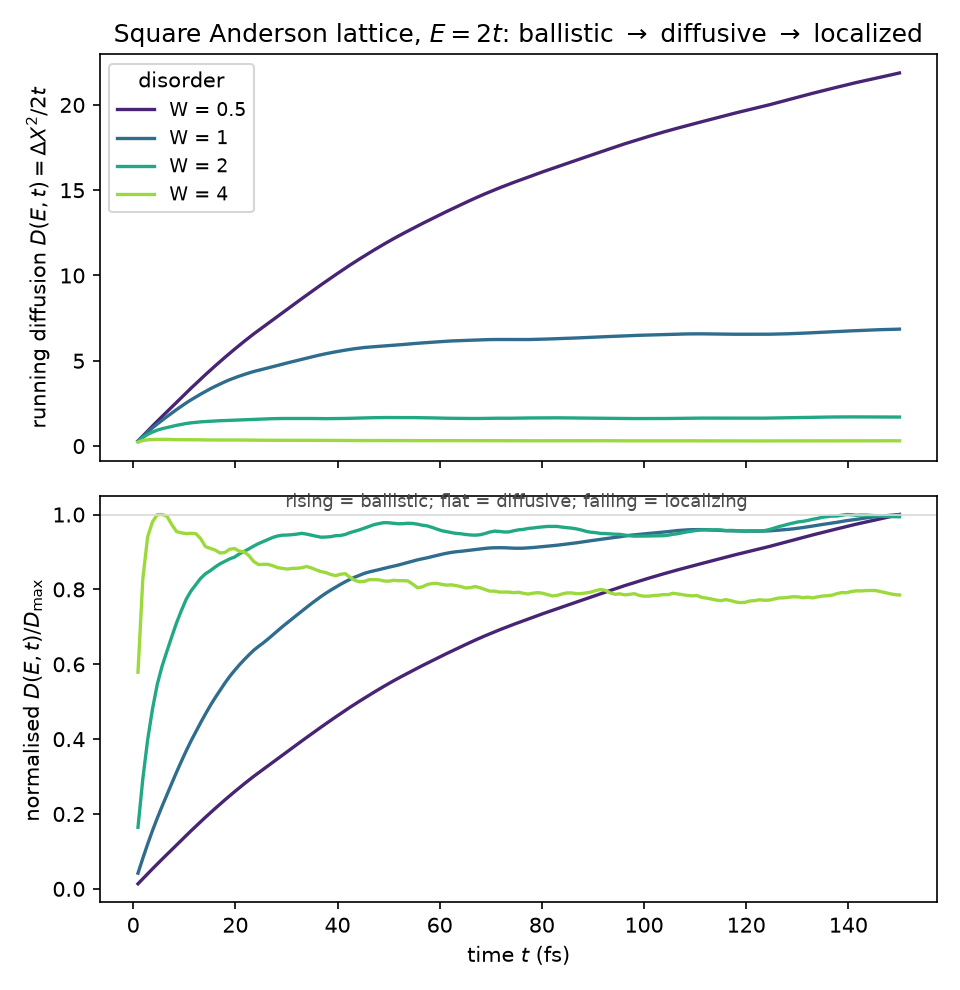
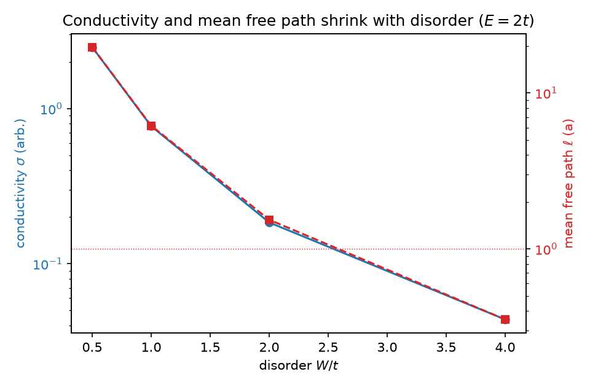

> Pedagogical tutorial — illustrative, not a regression golden.

# Tutorial 5: What sets the resistance of a disordered metal

A perfect crystal is a perfect conductor: an electron in a Bloch state flies
through it forever, and the resistance is zero. Every real metal has finite
resistance, and the reason is disorder. Impurities and defects scatter the
electron, breaking its ballistic flight into a random walk. The deep question is
how that random walk sets a number you can measure, the conductivity, and what
happens when the disorder grows so strong that the walk itself grinds to a halt.

We answer it on the 2D square lattice with onsite (Anderson) disorder by tracking
one thing: how far an electron spreads in time. The lesson here is that the
conductivity and the mean free path are read straight off that spreading, through
the Einstein relation, and that turning up disorder walks the system through three
regimes in order, ballistic, then diffusive, then localized.

## The physics

The model is the square lattice, one orbital per site, hopping $t$ (we set
$t = 1$ and lattice constant $a = 1$), with an independent random onsite energy on
each site:

$$ H = -t\sum_{\langle ij\rangle}\big(|i\rangle\langle j| + |j\rangle\langle i|\big) + \sum_i \epsilon_i\,|i\rangle\langle i|, \qquad \epsilon_i \ \text{uniform in}\ [-W/2,\,W/2]. $$

The clean band is $E_{\mathbf k} = -2t(\cos k_x + \cos k_y)$, filling $[-4t, 4t]$.
We work at a fixed energy $E = 2t$, away from the logarithmic van Hove singularity
at $E=0$ and from the band edges.

The quantity that carries everything is the mean-square displacement
$\Delta X^2(E,t)$, the spread of a wavepacket at energy $E$ after a time $t$. Its
time dependence names the regime, and its slope is the diffusion coefficient:

$$ \Delta X^2 \sim t^2 \ (\text{ballistic}), \qquad \Delta X^2 \sim t \ (\text{diffusive}), \qquad D(E,t) = \frac{\Delta X^2(E,t)}{2t}. $$

In the diffusive regime $D(E,t)$ settles on a plateau $D_{\max}(E)$, the
semiclassical diffusion coefficient. Two physical numbers follow at once. The
conductivity is the Einstein relation,

$$ \sigma(E) = e^2\,\rho(E)\,D_{\max}(E), $$

with $\rho(E)$ the density of states per site (Tutorial 1's KPM DOS). The mean
free path is $\ell = v_F\,\tau$; with $\Delta X^2$ the $x$-projection in 2D the
convention is $D_x = \tfrac12 v_F^2\tau$, so

$$ \ell = \frac{2\,D_{\max}}{v_F}, \qquad v_F = \big\langle\,|\nabla_{\mathbf k}E_{\mathbf k}|\,\big\rangle_{E\text{-contour}}. $$

The single idea of this tutorial: as $W$ grows, $D_{\max}$ falls, so $\sigma$ and
$\ell$ fall with it, and past a point the diffusion coefficient stops plateauing
and instead peaks and decays, the fingerprint of (weak) localization.

The clean starting point is a metal: the square-lattice band gives a Fermi contour
of states that carry current freely, which disorder will scatter.



## Step 1: build a disordered square lattice

The generator writes the Hamiltonian, the $x$-velocity operator, the disorder-widened
bounds, and the sidecar, all under `operators/` at run time:

```bash
python make_square.py 200 1 1
```

This builds `square_L200_W1` (a $200\times200$ lattice, $W=1$, seed 1). Onsite
disorder is diagonal, so the velocity operator is the clean one and acts only on
$x$-bonds, which is why $\Delta X^2$ is the $x$-projection of the spread. The next
step reads these.

## Step 2: ballistic flight becomes a random walk

Run the KPM mean-square displacement and reconstruct $\Delta X^2$ at the working
energy:

```bash
cat > run_msd.json <<'JSON'
{ "mode": "msd", "label": "square_L200_W1", "operator": "VX",
  "num_moments": 256, "num_times": 160, "tmax": 150 }
JSON
lsquant compute --config run_msd.json
inline_timeCorrelationsFromChebmom Correlation*square_L200_W1*chebmomTD 80 2   # (soon: a unified `lsquant reconstruct … msd` verb)
```

> **Entry points.** Moments via the modern `lsquant compute`; the time-domain
> reconstruction still uses `inline_timeCorrelationsFromChebmom`, which a unified
> `lsquant reconstruct … ` time-domain verb is planned to replace.

This evolves a wavepacket for 150 fs and writes $\Delta X^2(E=2,t)$. Forming
$D(E,t) = \Delta X^2/2t$, the early-time rise (where $\Delta X^2\sim t^2$) is the
ballistic flight between collisions, and the late-time plateau (where
$\Delta X^2\sim t$) is the diffusive random walk. The plateau value is
$D_{\max}(E)$.

## Step 3: read off the conductivity and the mean free path

The density of states at the same energy comes from Tutorial 1's recipe (the
identity operator's spectral function):

```bash
lsquant compute --config dos.json          # mode spectral, operator "1"
lsquant reconstruct SpectralOp1*.chebmom1D dos 80
```

For this lattice the KPM gives $\rho(E=2)\approx0.11$ per site, which matches the
analytic square-lattice density of states
$\rho_\square(E) = \tfrac{1}{2\pi^2 t}\,K\!\big(\sqrt{1 - E^2/16t^2}\big) \approx 0.109$
as a check (the production value uses the numerical DOS). With $v_F\approx2.2$ from
the band at $E=2t$, the Einstein relation and $\ell = 2D_{\max}/v_F$ give, at
$W=1$, $D_{\max}\approx6.9$, $\sigma\approx0.77$, and $\ell\approx6$ lattice
spacings, an electron that travels about six sites between collisions.

## Step 4: disorder drives ballistic to diffusive to localized

The sweep repeats Steps 1 to 3 for $W = 0.5, 1, 2, 4$ and draws the diffusion
curves:

```bash
python lsqtransport.py
```



The top panel reads the diffusion coefficient directly. For $W=0.5$ it climbs and
barely saturates: the mean free path is so long that the electron is still in
ballistic flight across the whole window. For $W=1$ and $W=2$ it rises and settles
on a clear plateau, the diffusive regime, and the plateau drops steeply as
disorder grows. The bottom panel normalises each curve to its own maximum, which
exposes the shape independent of magnitude: a rising curve is ballistic, a flat
one is diffusive, and a curve that peaks and then falls is localizing. At $W=4$
the diffusion coefficient overshoots and decays back to about 0.8 of its peak, the
signature that coherent backscattering is beginning to trap the electron.

## Step 5: conductivity and mean free path collapse with disorder



Both the Einstein conductivity and the mean free path fall by nearly two orders of
magnitude across the sweep, from $\ell\approx20$ sites at $W=0.5$ to
$\ell\approx0.35$ at $W=4$. They track each other because, at fixed energy, both
are set by $D_{\max}$ ($\rho$ and $v_F$ barely move), so $\sigma\propto\ell$. The
crossing of $\ell$ below one lattice spacing at large $W$ is the Ioffe-Regel
limit, where the semiclassical picture breaks down and the localization seen in
Step 4 takes over.

## What to take away

- The mean-square displacement names the transport regime: $\Delta X^2\sim t^2$ is
  ballistic, $\sim t$ is diffusive, and a falling $D(E,t)$ is localizing.
- The conductivity follows from the diffusion by the Einstein relation
  $\sigma = e^2\rho D_{\max}$, with the KPM density of states supplying $\rho$.
- The mean free path $\ell = 2D_{\max}/v_F$ shrinks monotonically with disorder,
  from many lattice spacings down through the Ioffe-Regel limit $\ell\sim a$.
- Increasing disorder walks the system through ballistic, diffusive, and localized
  transport in that order, all visible in one family of $D(E,t)$ curves.

The next tutorial keeps this square lattice and this diffusion machinery but gives
the electron a spin, and asks how disorder relaxes it.

## References and links

- LinQT source and documentation: https://github.com/adamecius/lsquant
- Methodology: Z. Fan, J. H. García, A. W. Cummings et al., *Linear Scaling
  Quantum Transport Methodologies*, arXiv:1811.07387.
- Installation: see the main README of the repository.

## Further reading

- A. Weisse, G. Wellein, A. Alvermann, H. Fehske, *The kernel polynomial method*,
  Rev. Mod. Phys. **78**, 275 (2006).
