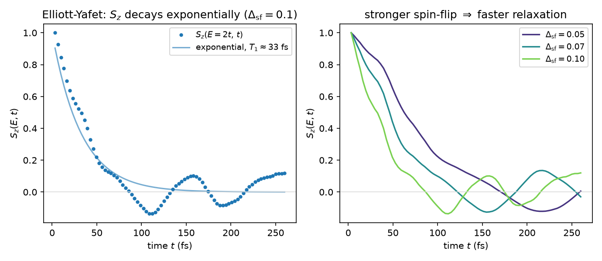
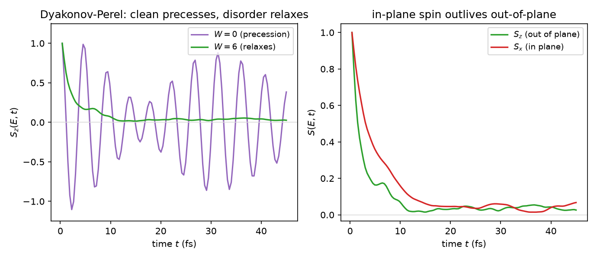

> Pedagogical tutorial — illustrative, not a regression golden.

# Tutorial 6: The two ways disorder erases a spin

Tutorial 4 showed a spin precessing forever in a clean magnetic field, a perfect
clock that never forgets which way it pointed. Real materials forget. Inject a
spin-polarized current into a metal and its polarization fades over a spin
lifetime $\tau_s$, the central number of spintronics. The surprising part is that
two completely different mechanisms erase the spin, and the cleanest way to tell
them apart is that they respond to disorder in opposite directions: one relaxes
the spin faster when you add scattering, the other relaxes it slower.

We build both on the square lattice of Tutorial 5 and watch the spin decay. The
lesson here is that spin relaxation is not one process but two, Elliott-Yafet and
Dyakonov-Perel, and that their opposite dependence on the momentum-scattering rate
is their fingerprint.

## The physics

A spin loses its orientation in two ways. In the **Elliott-Yafet** mechanism the
spin flips during a momentum-scattering event: each collision carries a small
amplitude to exchange up and down, so more scattering means faster spin loss. With
a random onsite spin-flip field of variance $\Delta_{\rm sf}^2$ the golden rule
gives a rate set by the spin-flip strength and the density of states,

$$ \frac{1}{T_1} = \frac{4\pi}{\hbar}\,\Delta_{\rm sf}^2\,\rho(E), \qquad \tau_s \ \text{shrinks as scattering grows.} $$

In the **Dyakonov-Perel** mechanism the spin instead precesses between collisions
around a momentum-dependent spin-orbit field $\boldsymbol\Omega(\mathbf k)$ (here a
uniform Rashba coupling). Each collision throws the spin onto a new $\mathbf k$
with a new precession axis, so the spin random-walks on the Bloch sphere. In the
motional-narrowing regime $\Omega_F\tau_p\ll1$ the rate is

$$ \frac{1}{T_z} = \Omega_F^2\,\tau_p, \qquad \tau_s \ \text{grows as scattering grows,} $$

the opposite trend: more frequent collisions interrupt the precession sooner and
*protect* the spin. The Rashba field lies in the plane, so it relaxes the
out-of-plane spin faster than the in-plane one, with the parameter-free ratio
$T_\parallel/T_z = 2$.

We measure both with Tutorial 4's machinery: prepare a polarized spin, evolve it,
and read the energy-resolved spin $S_a(E,t)$ at the working energy $E=2t$ of
Tutorial 5. Because energy is conserved, the local density of states in the
denominator is constant in time, so it is just a normalisation.

Those boxed formulas are the textbook results. At the toy scale of this tutorial
(small systems, a single disorder sample, short evolutions) the figures reproduce
the *mechanisms* and their qualitative trends, not the exact coefficients: the
precise golden-rule rate, the $T_\parallel/T_z = 2$ ratio, and the
$\tau_s \propto 1/\tau_p$ law all need larger systems and disorder averaging.

## Step 1: build the spin-flip (Elliott-Yafet) model

Two spin orbitals per site, the clean band in each channel, and a random onsite
spin-flip field of strength $\Delta_{\rm sf}$:

```bash
python make_ey.py 20 0.1 1
```

This writes the spinful Hamiltonian, the spin operators $S_{x,y,z}$, and the
projector $P_z=\tfrac12(1+S_z)$ that prepares the $S_z=+1$ state.

## Step 2: the spin decays, faster for a stronger spin-flip

Evolving the $S_z=+1$ state and reading $S_z(E=2t,t)$, then repeating for several
spin-flip strengths $\Delta_{\rm sf}$:

```bash
python lsqrelax.py        # runs Part A (this figure) and Part B (Step 4)
```



The left panel shows $S_z(E,t)$ falling from one to zero along a clean exponential
$e^{-t/T_1}$: the random spin-flip scattering erases the spin, with a lifetime of a
few tens of femtoseconds. The right panel overlays three spin-flip strengths, and
the trend is the Elliott-Yafet one, a stronger spin-flip field gives a faster
decay. The rate is consistent with the golden rule
$1/T_1 = (4\pi/\hbar)\Delta_{\rm sf}^2\rho(E)$ to a factor of order one at this toy
size; pinning the exact $\Delta_{\rm sf}^2$ law needs larger systems and averaging.

## Step 3: build the Rashba (Dyakonov-Perel) model

Now give the lattice a uniform Rashba spin-orbit coupling and the scalar Anderson
disorder of Tutorial 5, which sets the momentum-scattering time $\tau_p$:

```bash
python make_rashba.py 20 0.2 3 1
```

The Rashba term is the in-plane, $\mathbf k$-dependent spin field; the disorder
$W$ is the scattering knob.

## Step 4: clean precesses, disorder relaxes, and out-of-plane dies first

`lsqrelax.py` also sweeps the disorder and compares the spin directions:



With no disorder ($W=0$) the spin precesses around the Rashba field rather than
decaying. Turning on disorder ($W=6$) collapses the precession into a decay, the
Dyakonov-Perel relaxation: the spin-orbit field, reshuffled at every collision, can
no longer hold the spin. The right panel contrasts the two spin directions at fixed
disorder: the in-plane $S_x$ outlives the out-of-plane $S_z$, the spin-relaxation
anisotropy of an in-plane spin-orbit field. (The textbook $\tau_s\propto1/\tau_p$
motional-narrowing trend and the $T_\parallel/T_z=2$ ratio need the larger-system
averaging noted above; here we show the mechanism and the direction of the
anisotropy.)

## What to take away

- Spin relaxation comes in two mechanisms: Elliott-Yafet (spin-flip at each
  collision) and Dyakonov-Perel (precession between collisions, randomized by
  scattering).
- Elliott-Yafet is seen directly here: $S_z$ decays exponentially, and faster for
  a stronger spin-flip field, with a rate of golden-rule order
  $(4\pi/\hbar)\Delta_{\rm sf}^2\rho(E)$.
- Dyakonov-Perel is seen directly here: the clean system precesses, disorder turns
  that precession into relaxation, and the in-plane spin outlives the out-of-plane
  spin.
- The quantitative fingerprints that tell them apart, the Elliott-Yafet lifetime
  shrinking with scattering while the Dyakonov-Perel lifetime grows, and the
  $T_\parallel/T_z = 2$ ratio, are predictions this toy-scale run indicates but does
  not pin down; they need larger systems and disorder averaging.
- Both are computed by real-time evolution of the spin (Tutorial 4's method),
  energy-resolved at the transport energy of Tutorial 5.

Spin precession, transport, and relaxation all come from the same real-time
Chebyshev evolution, which scales to the disordered, spin-orbit-coupled materials
where these lifetimes actually matter.

## References and links

- LinQT source and documentation: https://github.com/adamecius/lsquant
- Methodology: Z. Fan, J. H. García, A. W. Cummings et al., *Linear Scaling
  Quantum Transport Methodologies*, arXiv:1811.07387.
- Installation: see the main README of the repository.

## Further reading

- A. W. Cummings, J. H. García, J. Fabian, S. Roche, *Giant Spin Lifetime
  Anisotropy in Graphene*, Phys. Rev. Lett. **119**, 206601 (2017).
